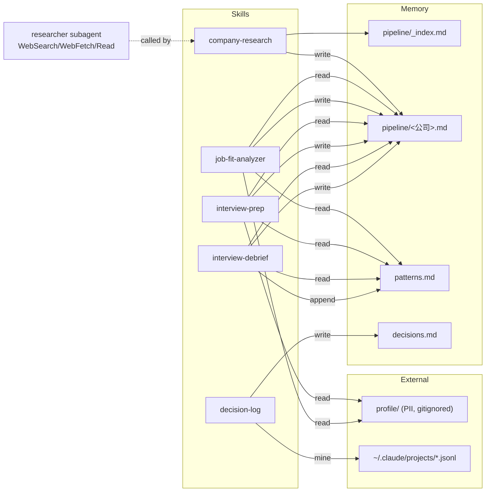

# career-plan

**一个让求职从"散乱"变成"有上下文、能复用"的 Claude Code 插件。**

每次聊一家公司、准备一场面试、复盘一次对话 —— 结果都沉淀到本地 memory，下一次从这里接着跑。

---

## 为什么要有它

用 Claude Code 陪自己找工作会遇到一个问题：**每开一个新会话就是一次从零开始**。你投过的岗位、吐槽过的红旗、反复犯的毛病 —— Claude 都不知道。

career-plan 把"求职"拆成 5 个 skill，它们之间用一套本地 memory 文件协作，形成：

```
投前尽调 → 岗位匹配度 → 面试准备 → 面试复盘 → 经验沉淀 → 反哺下一次
```

---

## 架构一图



**核心 idea**：5 个 skill 不直接互相调用，而是各自读写共享 memory。Memory 是解耦的总线。

---

## 5 个 Skill

| Skill | 什么时候触发 | 干什么 |
|---|---|---|
| **company-research** | "查一下 XX 公司" · "帮我尽调 XX" | 委派 `researcher` subagent 深搜 → 基本面/业务/团队/媒体/红旗 5 块报告 → 写入 `pipeline/<slug>.md` |
| **job-fit-analyzer** | 贴 JD · "这个岗位值不值得投" · "哪个适合我" | 识别 Inbound/Outbound 场景 → 对照 `profile/user-profile.md` → 维度打分 → 推荐简历版本 |
| **interview-prep** | "准备 XX 面试" · "帮我模拟面试" | 读 `profile/resume_*.md` + 历史 patterns → 四阶段流程：信息收集 → 补足计划 → 模拟面试 → 整体评估 |
| **interview-debrief** | "帮我复盘刚才的面试" · 贴转录/录音 | 对照 JD 和 patterns → 5 块输出（通过率/逐题打分/润色稿/缺口诊断/补课清单）→ 提炼可复用模式追加到 `patterns.md` |
| **decision-log** | "整理我最近的求职决策" · "sync decisions" | 扫 `~/.claude/projects/` 转录 → 粗筛命中求职关键词 → 细筛（Claude 判断）→ 追加到 `decisions.md`。幂等（state 文件去重） |

**辅助**：`agents/researcher.md` 是给 `company-research` 用的深搜 subagent，Haiku 模型，只给 WebSearch + WebFetch + Read 权限。

---

## Memory 布局

```
memory/
├── pipeline/
│   ├── _index.md            # 活跃 pipeline 一览（自动维护）
│   ├── <公司-slug>.md        # 一家一文件：尽调 / JD / 面试准备 / 复盘
│   └── archive/             # "凉了"或"拿到 offer"后手动挪进来
├── patterns.md              # 反复出现的模式（只追加，人在环里）
├── decisions.md             # 决策日志（decision-log 挖掘填充）
└── .decision-log-state.json # 挖掘脚本的已处理 session id
```

**为什么一公司一文件？** 同时推 2-3 家时，单文件会让下游 skill 读到无关公司的上下文造成污染。一公司一文件 + `_index.md` 导航是最干净的解法。

---

## 安装

### 前置
- Claude Code CLI
- Node 18+（挖掘脚本用）

### 步骤

```bash
# 1. 把插件放到任意路径（推荐开发路径或 ~/.claude/plugins 下）
git clone <本仓库> ~/career-plan   # 或 cp -r 进去

# 2. 准备用户数据（不进 git）
cd ~/career-plan
cp profile.template/user-profile.md profile/user-profile.md
cp profile.template/resume_template.md profile/resume_ai_technical.md
# 按需增加 resume_aigc.md、resume_strategy_growth.md
# 填入你的真实数据

# 3. 在 Claude Code 里注册插件
# (方式 A) /plugin 面板里选本地目录
# (方式 B) 或放进 ~/.claude/plugins/<marketplace>/plugins/career-plan/
```

---

## 怎么用 · 一个完整例子

假设你下周面一家叫 Foo Inc. 的公司：

```
你：查一下 Foo Inc.
Claude: → company-research
        → 写入 memory/pipeline/foo-inc.md
        → 更新 memory/pipeline/_index.md

你：[粘贴 JD] 这个岗位值不值得投？
Claude: → job-fit-analyzer
        → 读 foo-inc.md 的尽调 + profile/user-profile.md
        → 维度打分 + 简历版本建议
        → 追加 JD 子节到 foo-inc.md

你：准备 Foo 的面试，下周四
Claude: → interview-prep
        → 读 foo-inc.md + patterns.md + profile/resume_ai_technical.md
        → 四阶段流程（问你简历版本/准备时间/担忧点 → 补足计划 → 模拟 → 评估）
        → 追加"面试准备"子节到 foo-inc.md

面试结束。
你：[粘贴转录] 帮我复盘
Claude: → interview-debrief
        → 读 foo-inc.md 全节
        → 5 块输出
        → 追加"复盘"子节到 foo-inc.md
        → 提炼 2-3 条模式追加到 patterns.md（显式告知你，你可以否决）

一周后。
你：整理我最近的求职决策
Claude: → decision-log
        → 跑 scripts/mine-decisions.mjs 扫 ~/.claude/projects
        → 粗筛命中 N 条 → 细筛 K 条有效决策
        → 追加到 decisions.md
```

---

## 设计原则

1. **只追加不改写**：`patterns.md` 和 `decisions.md` 的自动写入一律 append 到末尾；改动由用户手动做
2. **文件不存在就不写**：`pipeline/<slug>.md` 不存在 = 还没跑尽调 = 不自动建。唯一可新建的是 `company-research`
3. **读 memory 是辅助**：不能因此跳过 skill 本身对用户的对话
4. **decision-log 不实时**：用挖掘（扫转录）而非实时追加。用户要 sync 才跑，幂等可重入
5. **归档显式触发**：用户说"凉了"/"拿到 offer"时才把 `pipeline/<slug>.md` 挪到 `archive/`，不自动 GC
6. **研究隔离**：深搜交给 `researcher` subagent（Haiku 模型）吐干净简报，原始搜索结果不污染主对话
7. **权限最小化**：researcher 只有 WebSearch + WebFetch + Read，不给写文件

---

## 隐私 & 安全

- `profile/`、`memory/pipeline/`、`memory/patterns.md`、`memory/decisions.md` **全部 gitignored**
- git 里只有插件骨架 + `profile.template/`
- 所有数据都在本地，不发任何外部服务（researcher 除外 —— 它会走 WebSearch，但不上传你的 profile）

---

## 限制

- **非实时**：decision-log 需要你主动喊"sync"。想要实时追加就自己改成 Stop hook
- **单用户单机**：memory 是本地文件系统。跨机同步靠你自己
- **researcher 依赖网搜**：国内工商信息（天眼查/爱企查）如果搜不到，会提示你手动贴截图
- **未验证多公司并行的极端情况**：同时推超过 5 家可能 `_index.md` 需要分组

---

## 目录结构

```
career-plan/
├── .claude-plugin/plugin.json
├── CLAUDE.md                  # 插件级跨 skill 约定
├── README.md                  # 本文件
├── .gitignore
├── skills/
│   ├── company-research/SKILL.md
│   ├── job-fit-analyzer/SKILL.md
│   ├── interview-prep/SKILL.md
│   ├── interview-debrief/SKILL.md
│   └── decision-log/
│       ├── SKILL.md
│       └── scripts/mine-decisions.mjs
├── agents/researcher.md
├── profile.template/          # 提交到 git
│   ├── user-profile.md
│   └── resume_template.md
├── profile/                   # gitignored
│   └── user-profile.md
└── memory/                    # 大部分 gitignored
    ├── pipeline/
    └── ...
```
