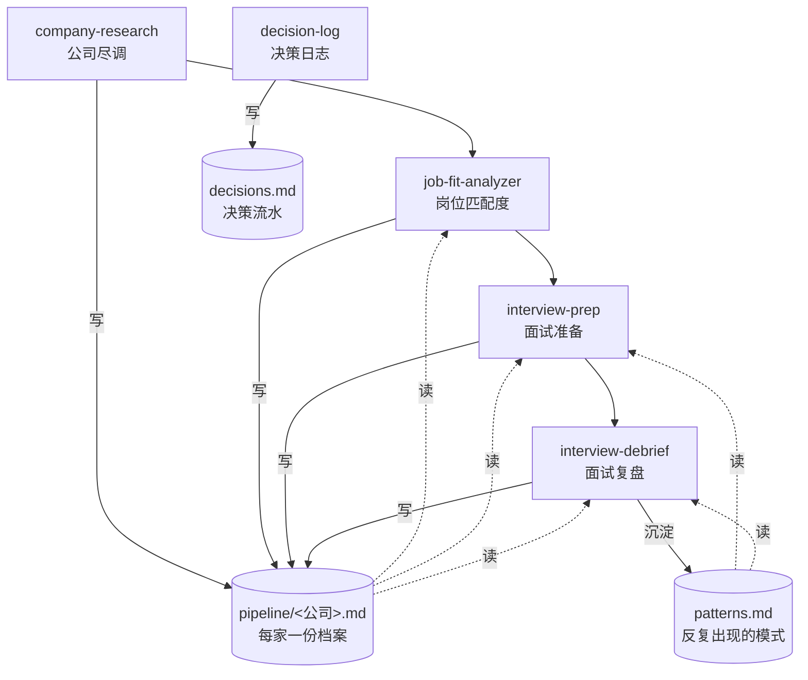

# career-plan

**让 Claude Code 陪你找工作时有"记性"。** 每次聊过的公司、准备过的面试、复盘过的对话，结果都存在本机，下一次接着用。

---

## 这是什么 / 为什么做

找工作本身是一个**有流程、有闭环**的事：尽调一家公司 → 评估岗位值不值得投 → 投了就开始准备面试 → 面完复盘 → 把这一轮学到的东西带到下一轮。

但用 Claude Code 陪自己走这套流程的时候，每次都是从零开始：上次查到的公司细节没沉淀、面试暴露的弱项下次 Claude 就忘了、一路做过的决策散落在各个会话里找不回来。跑十几家下来，**经验并没有叠加**——你其实在重复做同一件事十几次。

career-plan 要解决的就是这件事：**把每个环节的产出自动写进本地，下一个环节自动读过来，结束时把"这轮学到什么"沉淀成下一轮能直接用上的经验**。用得越久，你的画像、反复犯的毛病、面试经验、历次决策都会变成可复用的资产，而不是聊完就散。

---

## 一图看懂



五个技能不互相调用，各自读写共享的本地记忆文件——这就是"有记性"的实现方式。

---

## 五个技能分别在做什么

| 技能 | 什么时候它会自己跳出来 | 做什么 |
|---|---|---|
| **company-research** | 你说"查一下 XX 公司"、"帮我尽调 XX"、"XX 这家公司怎么样" | 让一个专门的研究 subagent 深度网搜，把公司的基本面、业务、团队、媒体痕迹、风险信号汇成一份报告；同时存进该公司的档案文件 |
| **job-fit-analyzer** | 你贴了一份 JD、"这个岗位值不值得投"、"哪个适合我" | 先判断场景（HR 主动来找你还是你主动投）→ 对照你的画像打分 → 推荐用哪版简历 |
| **interview-prep** | "准备 XX 面试"、"帮我模拟面试"、"下周要面 XX 怎么准备" | 按四个阶段走：收集背景 → 给补足计划 → 出题模拟 → 评估。出题会用你简历里真实的项目和数据，不编造 |
| **interview-debrief** | "帮我复盘刚才的面试"、贴转录或录音 | 给出通过率估计、逐题打分、重答版本、缺口诊断、补课清单五块；并把可复用的经验教训沉淀进记忆里 |
| **decision-log** | "整理我最近的求职决策"、"sync decisions" | 扫你过去的 Claude Code 对话，把真正的"投不投 / 怎么准备 / 要不要接 offer"这类决策摘出来，记成流水账 |

---

## 安装

把仓库下载到本机任意位置，在 Claude Code 里 `/plugin` 选本地路径加载即可。

### 装完要做的一次性准备

这个插件会用到两类属于你的私人信息：

1. **你的画像**——学历、实习经历、掌握的技能、你在乎什么
2. **你的简历**——可以有多个版本，对应你主攻的不同方向

第一次使用时，在终端里跑：

```bash
cd <插件所在目录>                                               # cd = 进入文件夹

cp profile.template/user-profile.md profile/user-profile.md    # cp = copy，复制模板
cp profile.template/resume_template.md profile/resume_main.md  # 复制简历模板
```

然后用你顺手的编辑器（VS Code / Typora / 任何文本编辑器都行）打开 `profile/` 下的这两个文件，把里面的占位符换成你自己的真实信息。

如果你针对**不同方向**准备了多份简历（比如同时投技术岗和运营岗），就多复制几份、起不同名字（例如 `resume_tech.md`、`resume_ops.md`）。`interview-prep` 会在面试准备时问你这次用的是哪版。

---

## 一个完整例子

假设下周一你要面一家叫 **Northbound** 的公司，职位是 XX。整个流程大概长这样：

```
你：查一下 Northbound 这家公司
→ company-research：用研究 subagent 网搜 + 汇总成报告
→ 在 memory/pipeline/ 下自动建了 northbound.md，把尽调结果存进去

你：（贴 JD）这个岗位我要不要投？
→ job-fit-analyzer：读刚才的尽调 + 你的画像 → 打分、给简历建议
→ 把 JD 要点追加到 northbound.md

你：帮我准备 Northbound 的面试，周一下午
→ interview-prep：读 northbound.md + 你过去反复犯的毛病
→ 问你用哪版简历、有多少准备时间、最担心什么
→ 给出补足计划 → 开始模拟面试

（面试结束后）
你：（粘贴转录）帮我复盘一下刚才的面试
→ interview-debrief：给出 5 块复盘
→ 追加"复盘"到 northbound.md
→ 把这次学到的 2-3 条可复用经验加进 memory/patterns，下次面试会自动用上

（一周后）
你：整理我最近的求职决策
→ decision-log：扫过去的对话，把真的做了决策的那些摘出来存成流水账
```

---

## 设计原则

1. **自动写入都是"添一行"，不动原内容**——怕插件写错了把你的笔记覆盖。要改某一条，你告诉我改什么、改成什么，我动手。
2. **没查过的公司不会凭空建档**——每家公司的档案文件是 `company-research` 第一次查这家时才建的，不会预生成一堆空文件。
3. **"这家凉了 / 拿到 offer 了" 要你说**——这类决定由你说出来，插件才会把档案挪去 `archive/`。它不会自作主张地判断。
4. **挖掘决策，不监听决策**——不是每次对话都在日志里塞一行，而是你主动喊"整理一下"它才去扫过去的聊天记录摘出决策。
5. **研究和主对话隔离**——深度网搜交给专门的 subagent 去做，原始搜索结果留在它那里，只把干净的简报返回给你。
6. **subagent 只能读**——研究用的 subagent 只有网搜 + 读网页的权限，不能写任何文件。

---

## 已知限制

- **不是实时的**：决策日志需要你主动喊"sync"
- **单机**：所有记忆都在本地文件系统，跨电脑同步要你自己搞（比如用 iCloud / Dropbox 同步插件目录）
- **国内工商数据**：如果研究 subagent 搜不到（天眼查/爱企查可能没公开），会提示你手动贴截图

---

## 文件目录

```
career-plan/
├── .claude-plugin/plugin.json # 插件元信息
├── CLAUDE.md                  # 给 Claude 看的跨技能约定
├── README.md                  # 给人看的（本文件）
├── skills/                    # 五个技能各一个文件夹
├── agents/researcher.md       # 深度研究 subagent
├── profile.template/          # 空白模板，首次使用时复制出来填
├── profile/                   # 你的画像和简历（本地）
└── memory/                    # 运行时记忆（本地）
    └── pipeline/              # 每家公司一份档案
```
